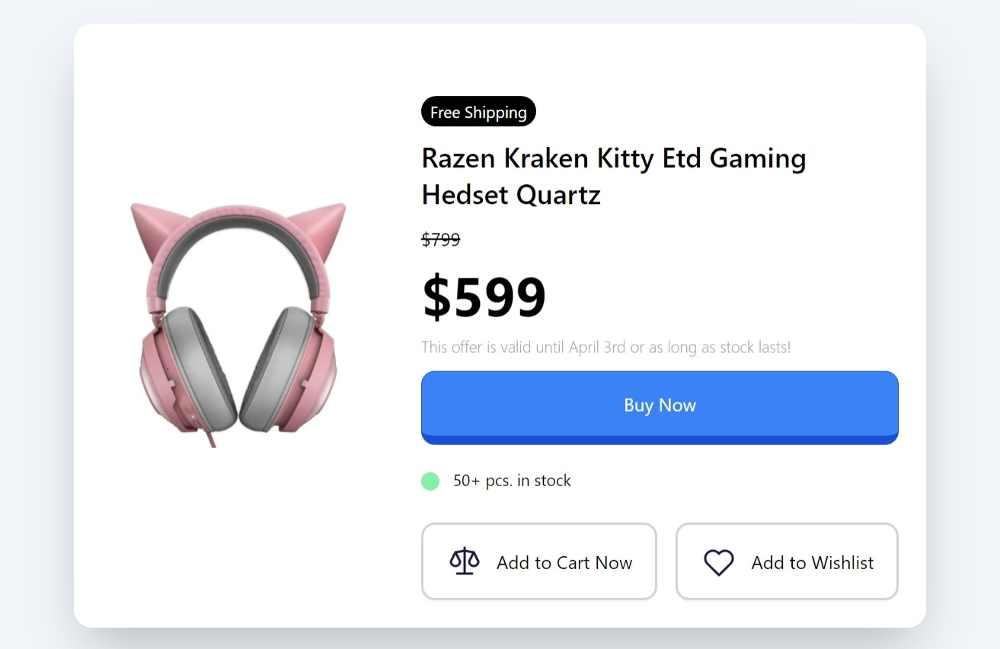

# Product-Modal

## Overview
This is a simple mini project with cute UI from my course where I've build an Product Modal Card with HTML and TailwindCSS.

### Users should be able to:

- View the optimal layout for the app depending on their device's screen size
- See hover states for all interactive elements on the page

### Screenshot

### Built with
- Semantic HTML5 markup
- Tailwind CSS using CDN
- Utility classes
- Mobile-first workflow

### Connect
- Website - Connect here
- Twitter - @ZareenFatima01
